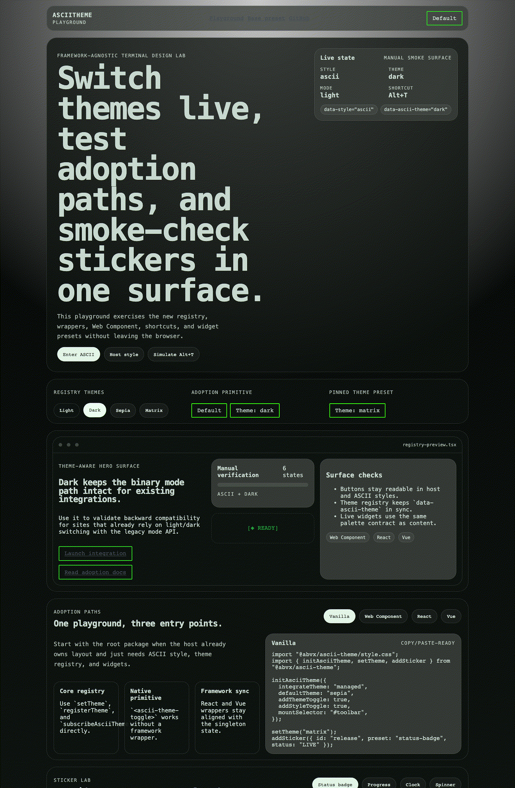
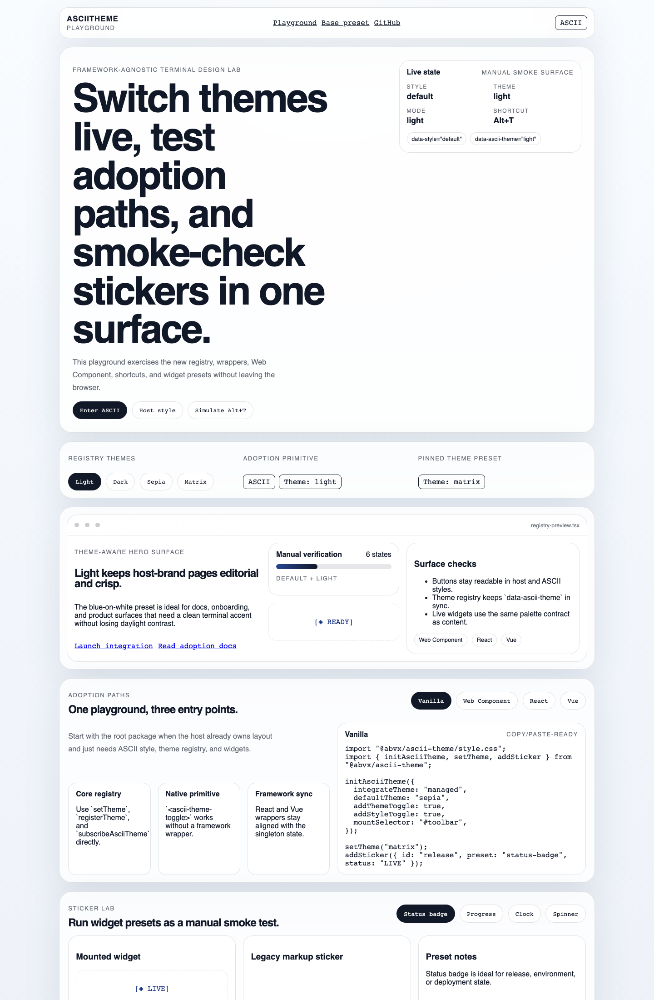
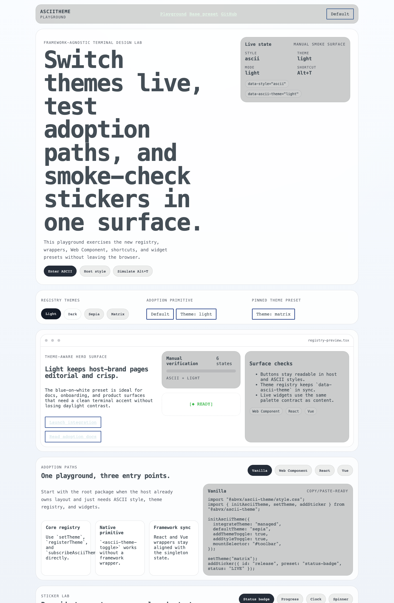
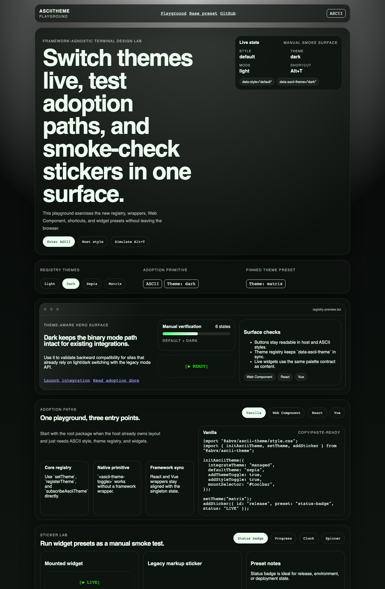
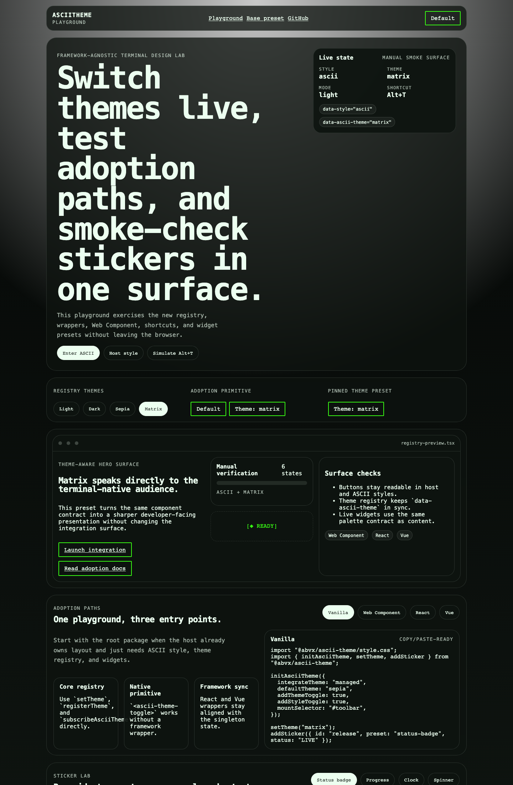

# AsciiTheme

[](https://www.npmjs.com/package/@abvx/ascii-theme)
[](https://github.com/markoblogo/AsciiTheme/actions/workflows/ci.yml)
[](https://markoblogo.github.io/AsciiTheme/)
[](LICENSE)

Add an optional ASCII visual layer to an existing site without replacing its design system.
AsciiTheme can respect the host theme, manage its own theme, or provide an ASCII-first base preset.

**[Try the live playground](https://markoblogo.github.io/AsciiTheme/)** · **[Install from npm](https://www.npmjs.com/package/@abvx/ascii-theme)**



## What it includes

- `default` / `ascii` style switching with persistent state
- built-in `light`, `dark`, `sepia`, and `matrix` themes
- optional theme and style toggle controls
- ASCII stickers and live `progress`, `clock`, `status-badge`, and `spinner` widgets
- one package with Vanilla, React, Vue, and Web Component entry points
- zero runtime dependencies

## Install

```bash
npm install @abvx/ascii-theme
```

```ts
import { initAsciiTheme } from "@abvx/ascii-theme";
import "@abvx/ascii-theme/style.css";

initAsciiTheme({
  integrateTheme: "auto",
  addStyleToggle: true,
});
```

`auto` detects an existing light/dark theme and leaves it in control. If none exists, AsciiTheme can manage the mode itself.

## Choose an integration

| Use case | Import | Start with |
| --- | --- | --- |
| Existing site | `@abvx/ascii-theme` | `integrateTheme: "auto"` |
| ASCII-first page | `@abvx/ascii-theme/base.css` | `base: true` |
| React | `@abvx/ascii-theme/react` | `AsciiThemeBoot` |
| Vue | `@abvx/ascii-theme/vue` | `createAsciiThemePlugin` |
| Web Component | `@abvx/ascii-theme/web-component` | `<ascii-theme-toggle>` |

### Managed theme and injected controls

```ts
import { initAsciiTheme } from "@abvx/ascii-theme";
import "@abvx/ascii-theme/style.css";

initAsciiTheme({
  integrateTheme: "managed",
  defaultTheme: "matrix",
  addThemeToggle: true,
  addStyleToggle: true,
  mountSelector: "#theme-controls",
});
```

### React

```tsx
import { AsciiThemeBoot, useAsciiTheme } from "@abvx/ascii-theme/react";
import "@abvx/ascii-theme/style.css";

export function ThemeControls() {
  const theme = useAsciiTheme();

  return (
    <>
      <AsciiThemeBoot options={{ integrateTheme: "auto" }} />
      <button onClick={theme.toggleStyle}>ASCII: {theme.style}</button>
    </>
  );
}
```

### Vue

```ts
import { createApp } from "vue";
import { createAsciiThemePlugin } from "@abvx/ascii-theme/vue";
import "@abvx/ascii-theme/style.css";

createApp(App)
  .use(createAsciiThemePlugin({ integrateTheme: "auto" }))
  .mount("#app");
```

### Web Component

```ts
import "@abvx/ascii-theme/style.css";
import "@abvx/ascii-theme/web-component";
```

```html
<ascii-theme-toggle controls="both"></ascii-theme-toggle>
```

### CDN

```html
<link rel="stylesheet" href="https://unpkg.com/@abvx/ascii-theme@0.3.1/dist/style.css">
<script src="https://unpkg.com/@abvx/ascii-theme@0.3.1/dist/ascii-theme.umd.js"></script>
<script>
  AsciiTheme.initAsciiTheme({ addStyleToggle: true });
</script>
```

Pin the version in production so a future release cannot change the page unexpectedly.

## Themes

```ts
import { registerTheme, setTheme } from "@abvx/ascii-theme";

registerTheme("amber", {
  label: "Amber terminal",
  mode: "dark",
  ascii: {
    bg: "#160f00",
    fg: "#ffbf47",
    muted: "#b9822d",
    accent: "#ffd27a",
    border: "#8f611f",
  },
});

setTheme("amber");
```

## Stickers and widgets

```ts
import { addSticker, updateSticker } from "@abvx/ascii-theme/stickers";

addSticker({
  id: "deploy",
  preset: "progress",
  target: "#build-status",
  value: 35,
  max: 100,
  ariaLabel: "Deployment progress",
});

updateSticker("deploy", { value: 80 });
```

Use `decorative: true` for purely visual stickers. Supply `ariaLabel` when a widget communicates state.

## Visual states

| Default | ASCII |
| --- | --- |
|  |  |
|  |  |

The playground also includes `ascii + dark` and `ascii + sepia` baselines. See [all captured states](docs/assets/playground).

## Public API

The root export provides:

- setup: `initAsciiTheme`, `AsciiTheme`
- style: `setAsciiStyle`, `toggleAsciiStyle`, `getAsciiThemeState`
- themes: `setTheme`, `registerTheme`, `getThemes`
- mode compatibility: `setAsciiMode`, `toggleAsciiMode`
- events: `subscribeAsciiTheme`
- stickers: `renderAsciiStickers`, `addSticker`, `updateSticker`, `removeSticker`

TypeScript declarations ship with every entry point. The package is SSR-safe: initialization becomes a no-op when the DOM is unavailable.

## Browser support and scope

AsciiTheme targets modern evergreen browsers. It styles supported HTML patterns and its own utilities; it does not automatically convert arbitrary hardcoded colors or third-party component markup. Start with `integrateTheme: "auto"` on an established site and review the affected pages visually.

## Development

Requires Node.js 20.19+ for the development toolchain.

```bash
npm ci
npm run check
npm run demo:dev
```

`npm run check` builds the package, runs integration tests, verifies the packed ESM/CJS/framework entry points, builds the demo, and audits dependencies.

More detail:

- [playground and visual capture](docs/playground.md)
- [integration smoke checks](docs/integration-smoke-check.md)
- [release verification](docs/release-surface.md)
- [contributing](CONTRIBUTING.md)
- [security policy](SECURITY.md)

## Related ABVX projects

- [ABVX Lab](https://lab.abvx.xyz/) — public project catalog
- [AGENTS.md Generator](https://github.com/markoblogo/AGENTS.md_generator), [SET](https://github.com/markoblogo/SET), and [ABVX Agent Skills](https://github.com/markoblogo/abvx-agent-skills) — adjacent agent tooling
- [Toki Pona Translator](https://github.com/markoblogo/toki-pona-translator) — consolidated Toki Pona toolkit with visual-language integrations

## License

[MIT](LICENSE)
